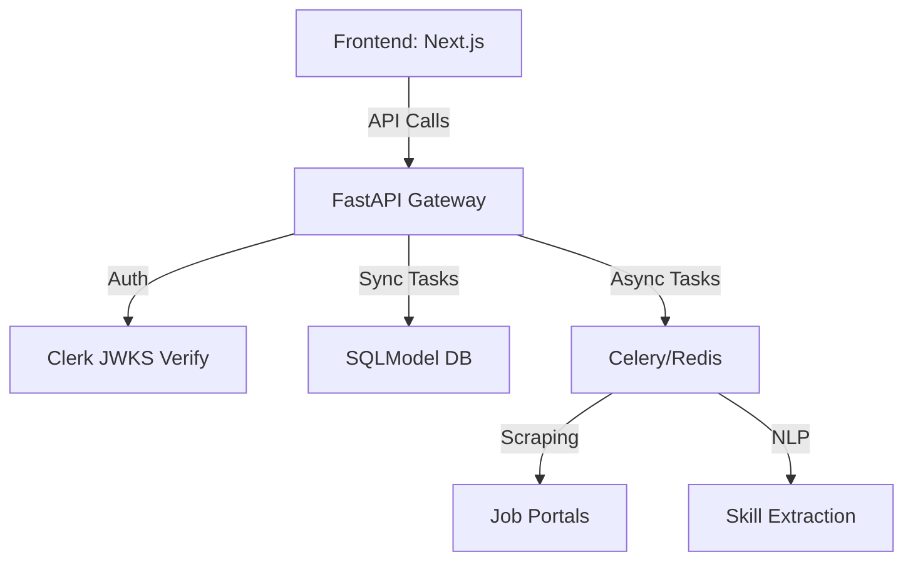

# 🎯 CareerCompass AI

[](https://opensource.org/licenses/MIT)
[](https://www.python.org/downloads/)
[](https://nextjs.org/)
[](https://clerk.com/)

An intelligent, full-stack platform designed to identify, analyze, and bridge the gap between your current skills and your dream career. CareerCompass AI leverages NLP and asynchronous processing to deliver personalized learning roadmaps and job market insights.

---

## ✨ Key Features

- **📄 Smart Resume Parsing**: Extracts skills and experience using spaCy NLP models.
- **🔍 Industry Alignment**: Real-time job scraping to compare your skills against live market requirements.
- **🗺️ Interactive Roadmaps**: Visual learning paths powered by React Flow.
- **🔐 Secure Identity**: Enterprise-grade authentication via Clerk with JWKS verification.
- **🚀 High-Performance Backend**: FastAPI with asynchronous task processing via Celery & Redis.
- **🎨 Premium UI/UX**: Minimalist 'techy' dark mode designed for focus and clarity.

---

## 🛠️ Tech Stack

| Layer | Technologies |
| :--- | :--- |
| **Frontend** | Next.js 14 (App Router), TypeScript, Tailwind CSS, Framer Motion, React Flow |
| **Backend** | FastAPI, Pydantic V2 (Settings & Schemas), SQLModel (PostgreSQL/SQLite) |
| **Security** | Clerk Auth, PyJWT (JWKS Verification), CORS Middleware |
| **Data & NLP** | spaCy, BeautifulSoup4, Selenium (Job Scraping) |
| **Task Queue** | Celery, Redis |

---

## 🚀 Getting Started

### Prerequisites

- **Python 3.11+**
- **Node.js 18+**
- **Redis Server** (Local or Cloud)
- **Clerk Account** (For Auth)

### 1. Clone & Environment Setup

```bash
git clone https://github.com/sai21-learn/carrer-gap-analyser.git
cd carrer-gap-analyser
```

### 2. Backend Setup

```bash
cd backend
python -m venv .venv
source .venv/bin/activate  # Windows: .venv\Scripts\activate
pip install -r requirements.txt
```

Create a `backend/.env` file:
```env
DATABASE_URL=sqlite:///./career_gap.db
REDIS_URL=redis://localhost:6379/0
CLERK_JWKS_URL=https://<your-clerk-domain>/.well-known/jwks.json
```

Run the servers:
```bash
# Terminal 1: API Server
uvicorn app.main:app --reload

# Terminal 2: Celery Worker
celery -A app.celery_worker worker --loglevel=info
```

### 3. Frontend Setup

```bash
cd frontend
npm install
```

Create a `frontend/.env.local` file:
```env
NEXT_PUBLIC_CLERK_PUBLISHABLE_KEY=pk_test_...
CLERK_SECRET_KEY=sk_test_...
NEXT_PUBLIC_CLERK_SIGN_IN_URL=/sign-in
NEXT_PUBLIC_CLERK_SIGN_UP_URL=/sign-up
```

Start the dev server:
```bash
npm run dev
```

---

## 🏗️ Architecture

The project follows **Clean Architecture** principles to ensure scalability and maintainability:



- **Models**: Pure database entities (SQLModel).
- **Schemas**: Decoupled API request/response models (Pydantic).
- **Services**: Business logic (Roadmap generation, Gap analysis).
- **Core**: Shared utilities, NLP engine, and scraper drivers.

---

## 📁 Project Structure

```bash
.
├── backend/
│   ├── app/
│   │   ├── api/          # API Routers (v1)
│   │   ├── core/         # NLP, Scrapers, Config (Pydantic Settings)
│   │   ├── models.py     # Database Entities
│   │   ├── schemas.py    # API Data Models
│   │   └── auth.py       # Clerk Security Logic
│   └── requirements.txt
├── frontend/
│   ├── app/              # Next.js App Router
│   ├── components/       # Reusable UI/Dashboard components
│   └── tailwind.config.ts
└── README.md
```

---

## 🤝 Contributing

Contributions are what make the open-source community such an amazing place to learn, inspire, and create. Any contributions you make are **greatly appreciated**.

1. Fork the Project
2. Create your Feature Branch (`git checkout -b feature/AmazingFeature`)
3. Commit your Changes (`git commit -m 'Add some AmazingFeature'`)
4. Push to the Branch (`git push origin feature/AmazingFeature`)
5. Open a Pull Request

---

## 📄 License

Distributed under the MIT License. See `LICENSE` for more information.

---
<p align="center">
  Built with ❤️ for the future of career development.
</p>
